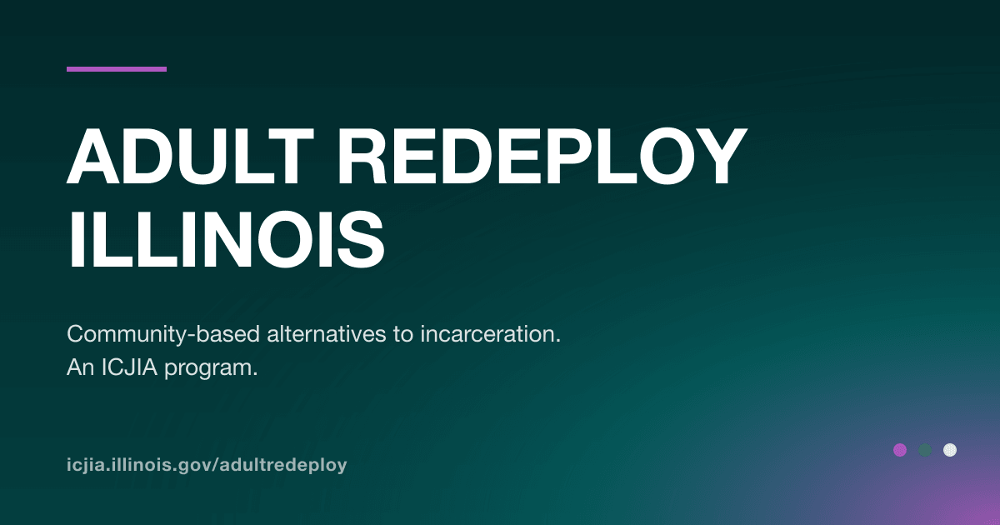

# Adult Redeploy Illinois — site

Astro 5 + Tailwind 4 + Alpine.js. A **static build with client-side "live islands"**:
every page is prerendered (SEO / Pagefind / no-JS / instant paint all intact), then
small Alpine islands refetch the Strapi CMS in the browser and swap in changed
content — so content authors see published edits within ~1s of a reload, with **no
rebuild**. Production: <https://icjia.illinois.gov/adultredeploy>.

## Local dev

    nvm use            # Node 22
    cp .env.sample .env
    npm install
    npm run dev        # fetches Strapi, then astro dev (port 4321)

## Build

    npm run build      # fetch Strapi → build SVG/OG → astro build → Pagefind index

Output: `dist/`.

## Preview (production output)

    npx astro preview  # serves the built dist/ under /adultredeploy

Use this (not `astro dev`) when measuring performance or smoke-testing the live
islands — `astro dev` ships unminified JS + the Astro toolbar, so its Lighthouse
scores are an artifact.

## Live CMS islands

Static-first, then live-refresh after paint **and** on tab focus; a region swaps only
when its content **signature** changed (a list's tracked fields, or an entry's
`updatedAt`). A thin top progress bar runs on every query (even no-change), changed
content fades in, one polite `aria-live` announce fires on a real change, all motion is
`prefers-reduced-motion`-gated, and swaps are opacity/overlay-only so there's **no CLS**.
On any fetch failure the static DOM is kept (never blanks).

**For authors:** publish in Strapi, then just reload any page.

Live surfaces:

- **Home** — About, ARI News, Upcoming Meetings
- **News** — index + article detail
- **Meetings** — index (per committee) + meeting detail
- **Sites** — index + site detail
- **Programs** — the county-map **side panel** (site title/summary/link). The set of
  *clickable* counties is build-time: it comes from a static legacy config
  (`scripts/usiljs-config.js`), not the CMS, so a newly-funded county appears on the
  next rebuild while existing counties' panel data refreshes live.

The module lives in `src/lib/live/` (data / behavior / render / config layers — see its
own `README.md`) and is built to be extracted for reuse on other Astro/Tailwind/Alpine
sites: only `config.ts` + `render/` are site-specific. Detail-page markdown is
re-rendered by the **same isomorphic renderer** as the build, imported lazily and only
when content actually changed (a chunk most views never download).

## Architecture notes

- **Base path** `/adultredeploy` (`astro.config.mjs`). Internal links carry the prefix;
  the built files sit at the dist **root**.
- **Served via the ICJIA proxy.** `icjia.illinois.gov/adultredeploy/*` is a `200!`
  rewrite (in the flagship `icjia-public-client-2021` repo) that **strips**
  `/adultredeploy` before forwarding here. Consequence: this repo's `netlify.toml`
  redirects use an **un-prefixed `from`** (matches the stripped path) and a **prefixed
  `to`** (the browser-facing `Location`).
- **View the raw deploy directly** (no proxy, for fast checks):
  <https://adultredeploy.netlify.app/adultredeploy/> — a top-level rewrite strips the
  prefix on the bare host. Safe for production: proxied requests arrive already stripped
  and never match `/adultredeploy/*`; canonical URLs still point at
  `icjia.illinois.gov`.
- **CMS:** public Strapi 3 GraphQL at `https://ari.icjia-api.cloud/graphql` — used by
  both the build fetch and the browser live fetch, so it must stay in the CSP
  `connect-src` (`netlify.toml`).
- **Sitemap:** `/sitemap.xml` `200`-rewrites to `sitemap-0.xml` (the actual URL list;
  `@astrojs/sitemap` also emits an index that reads as "a single page"). This is the
  path wired to Google Search Console; it regenerates every build.

## Scripts

| command | what it does |
|---|---|
| `npm run dev` | fetch Strapi + CMS images, then `astro dev` |
| `npm run build` | fetch → build SVG + OG image → `astro build` → Pagefind |
| `npm run preview` | serve the built `dist/` |
| `npm run check` | `astro check` (type-check) |
| `npm test` | `vitest` (markdown sanitizer + live render-parity) |
| `npm run audit` | axe + Lighthouse against the build |
| `npm run check:links` | crawl built HTML for broken links |

## Deployment

Netlify deploys `master` to the `adultredeploy` site. A push triggers a build (fetch
Strapi → build → Pagefind). The full conversion playbook and every architecture lesson
behind this site live in [`docs/astro-conversion-checklist-v8.1.md`](./docs/astro-conversion-checklist-v8.1.md).
